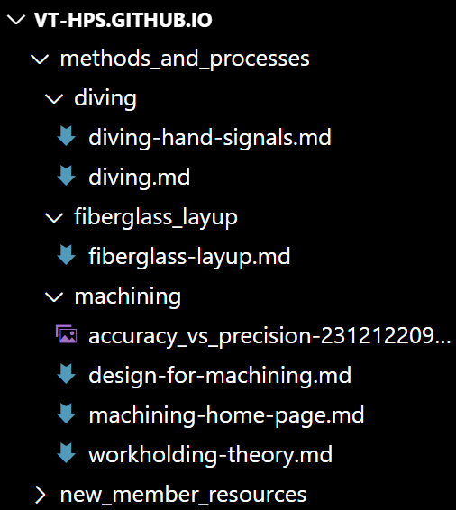

# Wiki Style Guide (WIP)
Please read this page completely before editing the wiki, and please return to it any time you are unsure. If you notice something does not conform to the style guide, please tell the current team Datamaster.

## File naming conventions
>Sometimes the GitHub wiki system that this site is built on doesn't play nice with files that use spaces as line separators. To avoid problems, no folder or file name should use spaces as seperators.

**Folders** are to be **all lowercase** and use **underscores** (_) as seperator characters.

**.md files** are to be **all lowercase** and use **hyphens** (-) as seperator characters.

**Reference files** (such as images) do not have to adhere to a particular style; just **no spaces allowed**.

